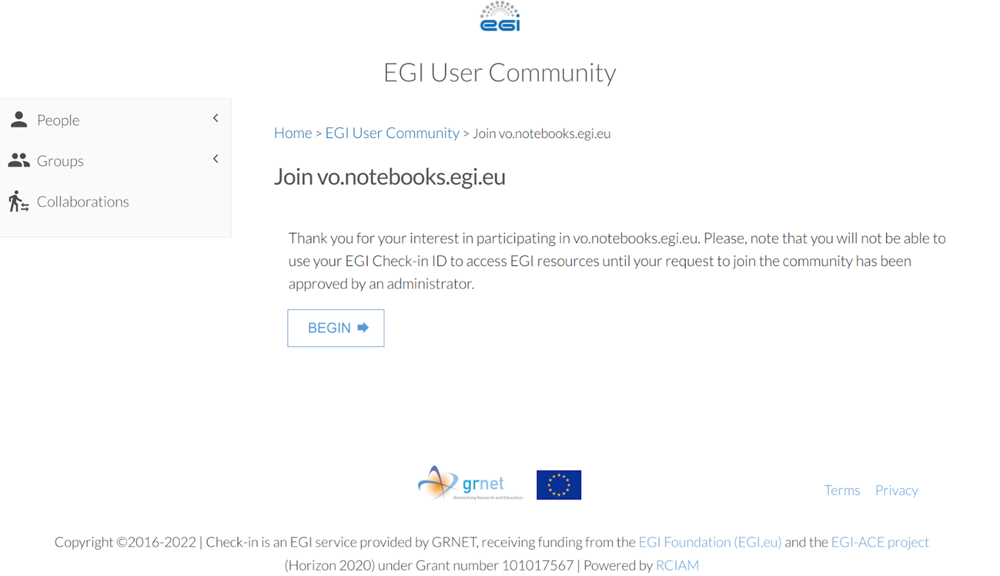
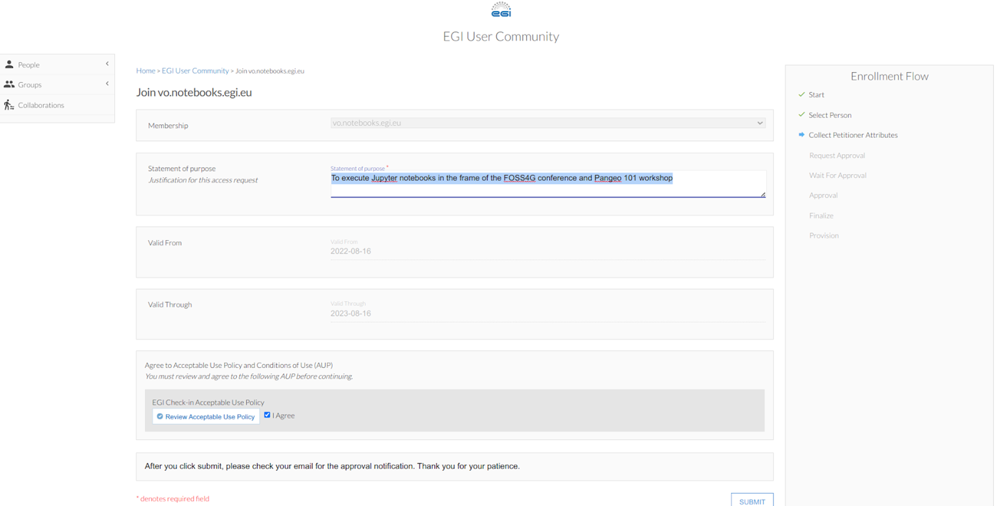

# How to connect your pangeo-eosc object storage using EGI check-in to your 'bucket' at pangeo-eosc-jupyter

We will need different 'token' 'key' to proceed with object storage.  Here are the list of token and keys we'll create in this page.  

- OIDC_ACCESS_TOKEN
- openstack token
- aws_access_key_id
- aws_secret_access_key

# Request read/write access to cloud resource 

1.  sign up for an EGI account (**Production EGI instance:aai**) by clicking on :  [https://aai.egi.eu/registry/co_petitions/start/coef:2](https://aai.egi.eu/registry/co_petitions/start/coef:2).  
2.  Enroll to the **vo.pangeo.egi.eu** VO by clicking on [https://aai.egi.eu/registry/co_petitions/start/coef:386](https://aai.egi.eu/registry/co_petitions/start/coef:386). This will take you to the website shown on the Figure  and then to . For the latter e.g. when asking to join the EGI VO notebook,  in the "statement for purpose" simply write “**To execute Jupyter notebooks during eScience Course as student (or mentor)**”. Review and agree on the policy and click on “Submit”. 
3.  Before going to next step, restart your web browser.  

## Setup your command line enviroment

First, we need a command line on your jupyterlab environment.  Start a terminal from a launcher.  
Then create an openstack environment using mamba.  

```
mamba create -n openstack  python jq s3fs gcc awscli --yes  -c conda-forge
conda deactivate
conda activate openstack
pip install fedcloudclient
```

## Connect your environment with EGI Check-In

If your access token is not created yet, create it at [https://aai.egi.eu/token/](https://aai.egi.eu/token/).

It is a very long string, but do not worry, copy and past it instead of `<your_token>` (without any space beofore or after the `=` sign) like below:


```
export OIDC_ACCESS_TOKEN=`<your_token>`
```

Now plz check if your fedcloud token works with following command

```
fedcloud token check
```

Next, copy and paste following command to access pangeo object storage.  
```
export OS_AUTH_URL=https://identity.cloud.muni.cz/v3
export OS_AUTH_TYPE=v3oidcaccesstoken
export OS_PROTOCOL=openid
export OS_IDENTITY_PROVIDER=egi.eu
export OS_ACCESS_TOKEN=$OIDC_ACCESS_TOKEN
export OS_PROJECT_ID=57102d3e06b7476088fe4924370ae170
export OS_STORAGE_URL=https://object-store.cloud.muni.cz/swift/v1

openstack container list

```

If the last command returns something similar to

```
+------------+
| Name       |
+------------+
| WG1        |
| input-data |
| test-gey   |
| test-slv   |
| tmp        |
+------------+
```
then
you are good, properly identified and connected with EOSC cesnet hosted openstack based  pangeo private backet..  

## Retrieve Openstack token for Swift

You can run following command to retrive your openstack token
This token 
```
$ openstack token issue -c id -f value
```


## Connect your environment with pangeo-eosc object storage. 

You need a pair of Access and Secret keys (`aws_access_key_id` and `aws_secret_access_key`)
in order to have read-write access to pangeo-eosc object store space from your enviroment
through AWS S3 interface.  

Use the following command to see if you already have those keys or not:

``` 
openstack ec2 credentials list
```

If you have nothing listed, then type the following command in order to create them:

```
openstack ec2 credentials create
```

Then list the credentials created by issuing the `credentials list` command :


```
openstack ec2 credentials list 
```

This will provide you `aws_access_key_id` and `aws_secret_access_key`

```

+----------------------------------+----------------------------------+----------------------------------+------------------------------------------------------------------+
| Access                           | Secret                           | Project ID                       | User ID                                                          |
+----------------------------------+----------------------------------+----------------------------------+------------------------------------------------------------------+
| x1xx | x2xx | x3xxxxxx | x4xxxxxx |
+----------------------------------+----------------------------------+----------------------------------+------------------------------------------------------------------+

```

Copy the values at `x1xx` and `x2xx` and past them instead of `x1xx` and `x2xx` in the next command:

```
aws configure set aws_access_key_id x1xx
aws configure set aws_secret_access_key x2xx
``` 


