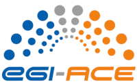

# Welcome 👋

:::{tip}
The computing and storage resources used for this workshop have been kindly provided by [CESNET](https://www.cesnet.cz/?lang=en) in the frame of the [EGI-ACE](https://www.egi.eu/project/egi-ace/) project that provides advanced Computing for [EOSC](https://eosc-portal.eu/about/eosc).
:::

## FOSS4G Annual International Gathering

[FOSS4G](https://foss4g.org/) stands for **Free and Open Source Software for Geospatial** and is the annual recurring global event hosted by [OSGeo](https://www.osgeo.org/), the non-profit organization that supports and promotes the collaborative development of free and open source geographic technologies and open geospatial data. 

### FOSS4G Pangeo 101 workshop

An [introduction to the Pangeo ecosystem](https://talks.osgeo.org/foss4g-2022-workshops/talk/NF8BKU/) will be provided by the Pangeo Community. 
You will learn how to efficiently access, analyze and visualize geospatial data at scale. 
The workshop timeline, setup and content of the workshop are accessible via the left menu of this webpage.

## The European Open Science Cloud (EOSC)

The [European Open Science Cloud (EOSC)](https://eosc-portal.eu/about/eosc) aims at becoming the main environment for hosting and processing research data to support European Science. 

The ambition of EOSC is to have a **federated** and **open multi-disciplinary** environment where you can publish, find and re-use data, tools and services for research, innovation and educational purposes. 
There is not one unique cloud provider offering all the EOSC compute and storage resources: an [onboarding process](https://eosc-portal.eu/providers-documentation/eosc-provider-portal-basic-guide) has been defined to allow new resource providers to register their services to EOSC.

It is still under development and often difficult to understand what is made available to you or what will be made available. 
On the other hand, as a researcher, innovator, company or citizen you can contribute to build it, for instance by providing feedback on the available tools and services. 

EOSC is run as a [co-programmed European Partnership under Horizon Europe from 2021](https://ec.europa.eu/info/horizon-europe/european-partnerships-horizon-europe/candidates-across-themes_en). [Horizon Europe](https://ec.europa.eu/info/horizon-europe_en) is the European Commission's research and innovation funding programme (started in 2021 and succeeding Horizon 2020 European programme).

## Pangeo Europe and EGI-ACE

 

[Pangeo](https://pangeo.io/) is a worldwide community for Big Data geoscience promoting open, reproducible, and scalable science. 

[Pangeo Europe](https://pangeo.io/meeting-notes.html) aims at highlighting European contributions to the Pangeo Community and at providing a reference deployment for Pangeo on EOSC. 
The Pangeo deployment on EOSC has been made possible thanks to [EGI-ACE](https://www.egi.eu/project/egi-ace/) project through their [Open Call](https://www.egi.eu/egi-ace-open-call/).

[EGI-ACE](https://www.egi.eu/project/egi-ace/) (EU H2020 project, January 2021 - June 2023) offers compute and storage resources, compute platform services, data management services and related user support and training through open calls. 
Majority of the services are sponsored (pre-paid) for the users by the European Commission and by national funding agencies. Some of the services are offered by commercial entities on a pay-per-use basis. 

**For the deployment of Pangeo on EOSC, [CESNET](https://www.cesnet.cz/?lang=en) is the provider that freely offered computing resources and storage.**
